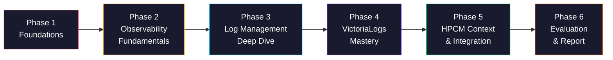
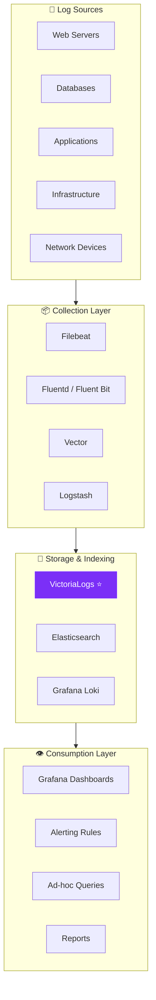
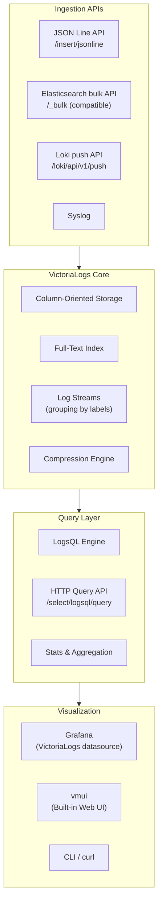
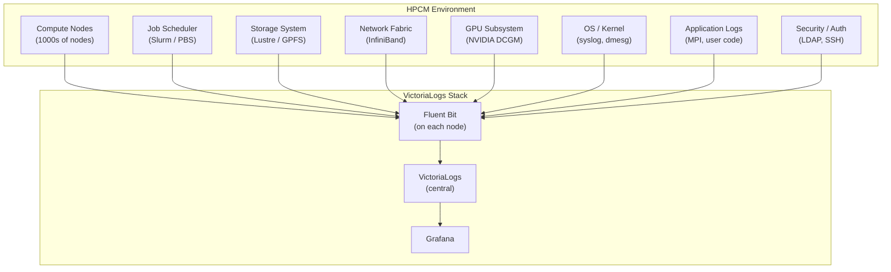
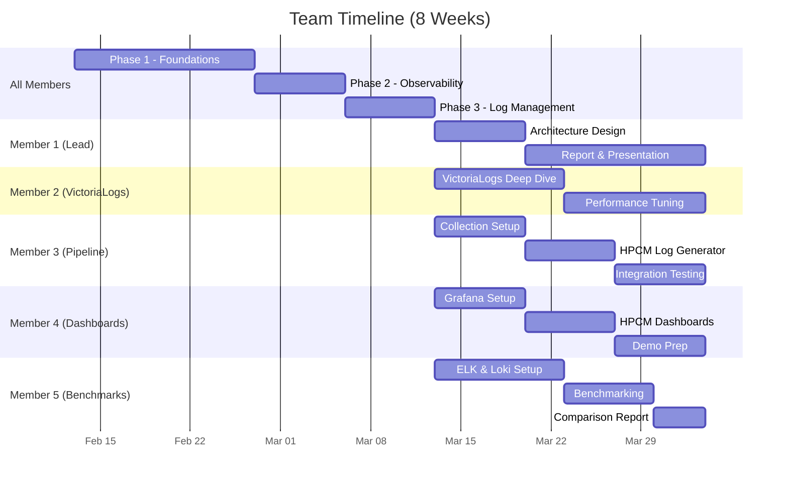

# 🚀 Complete Roadmap: VictoriaLogs for HPCM Log & Event Management

> **Team Size:** 5 members  **Goal:** Evaluate VictoriaLogs for HPCM Observability

---

## How to Read This Roadmap

This roadmap is split into **6 Phases**. Each phase builds on the previous one. The early phases are foundational knowledge; the later phases align directly with problem statement.



---

# Phase 1 — Foundations (Week 1–2)

> **Goal:** Build the base skills every team member needs before touching observability.

## 1.1 Linux & Command Line Basics

You'll be working with servers, containers, and config files. Linux is non-negotiable.

| Topic | What to Learn | Why It Matters |
|-------|--------------|----------------|
| File system navigation | `ls`, `cd`, `pwd`, `find`, `cat`, `less`, `tail` | You'll read log files constantly |
| File editing | `nano` or `vim` basics | Edit config files on servers |
| Permissions | `chmod`, `chown`, `sudo` | Security and access control |
| Process management | `ps`, `top`, `htop`, `kill` | Monitor running services |
| Networking commands | `curl`, `wget`, `ping`, `netstat`, `ss` | Debug connectivity issues |
| Package management | `apt` (Debian/Ubuntu) or `yum` (CentOS) | Install tools |
| Shell scripting basics | Variables, loops, conditionals in bash | Automate repetitive tasks |

> [!TIP]
> **Resources:** [LinuxJourney.com](https://linuxjourney.com/), [OverTheWire Bandit](https://overthewire.org/wargames/bandit/) (gamified CLI learning)

## 1.2 Networking Fundamentals

Logs travel over networks. You must understand how.

| Topic | What to Learn |
|-------|--------------|
| IP addresses & ports | How machines find each other |
| HTTP/HTTPS | How web APIs communicate (VictoriaLogs uses HTTP APIs) |
| TCP vs UDP | Reliable vs fast communication |
| DNS | Domain name resolution |
| REST APIs | How you'll interact with VictoriaLogs programmatically |
| JSON format | The universal data format for logs and APIs |

> [!TIP]
> **Resources:** [Computer Networking by Kurose & Ross (Chapter 1–2)](https://gaia.cs.umass.edu/kurose_ross/online_lectures.htm), FreeCodeCamp networking videos on YouTube

## 1.3 Docker & Containers

VictoriaLogs, Grafana, and all tools you'll use run in containers. This is **critical**.

| Topic | What to Learn |
|-------|--------------|
| What are containers? | Lightweight, isolated environments for running software |
| Docker basics | `docker run`, `docker ps`, `docker logs`, `docker exec` |
| Dockerfiles | How to build custom container images |
| Docker Compose | Run multi-container setups (e.g., VictoriaLogs + Grafana together) |
| Volumes | Persist data across container restarts |
| Port mapping | Expose container ports to your machine |
| Docker networking | How containers talk to each other |

> [!TIP]
> **Resources:** [Docker Get Started Guide](https://docs.docker.com/get-started/), TechWorld with Nana Docker Tutorial on YouTube

### 🎯 Phase 1 Checkpoint

Every team member should be able to:
- [ ] Navigate a Linux terminal comfortably
- [ ] Make HTTP requests using `curl`
- [ ] Run a Docker container and access a web UI through port mapping
- [ ] Write a basic `docker-compose.yml` file

---

# Phase 2 — Observability Fundamentals (Week 2–3)

> **Goal:** Understand WHY observability exists and the ecosystem of tools.

## 2.1 Why Observability?

### The Problem

Modern applications are **distributed** — they're not one big program running on one machine. They're dozens or hundreds of **microservices** across many servers. When something breaks:

- You can't just check "the" server — there are hundreds
- You can't just read "the" log file — there are millions of lines across thousands of files
- You can't reproduce the issue — it might only happen under specific load conditions

### The Solution: Observability

A centralized system that collects, stores, and lets you query all operational data.

## 2.2 The Three Pillars of Observability

### Pillar 1: Logs 📜

**What:** Timestamped text records of events in your system.

```
2026-02-12T20:30:01Z level=INFO msg="User login successful" user_id=42 ip="192.168.1.1"
2026-02-12T20:30:05Z level=ERROR msg="Database connection timeout" db="postgres" duration=30s
```

**Key characteristics:**
- High volume (millions of lines/day)
- Unstructured OR structured (JSON)
- Most detailed form of telemetry
- Storage-intensive

### Pillar 2: Metrics 📊

**What:** Numerical values measured over time.

```
cpu_usage{host="server-1"} 78.5   @1707763200
memory_used_bytes{host="server-1"} 4294967296  @1707763200
http_requests_total{path="/api/users", status="200"} 15234  @1707763200
```

**Key characteristics:**
- Low volume, highly compressed
- Great for dashboards and alerting
- Shows trends over time
- NOT good for debugging specific issues

### Pillar 3: Traces 🔍

**What:** End-to-end journey of a single request across all services.

```
TraceID: abc123
├─ Service: API Gateway   (12ms)
│  └─ Service: Auth       (3ms)
├─ Service: User Service  (45ms)
│  └─ Service: Database   (38ms)
└─ Total: 57ms
```

**Key characteristics:**
- Shows request flow
- Identifies bottlenecks
- Essential for debugging distributed systems

## 2.3 Observability Tool Landscape

Understanding the ecosystem helps you position VictoriaLogs correctly.

| Category | Tools | Notes |
|----------|-------|-------|
| **Log Management** | **VictoriaLogs**, Elasticsearch/ELK, Grafana Loki, ClickHouse | ⬅️ Your focus area |
| **Metrics** | VictoriaMetrics, Prometheus, Datadog, InfluxDB | Numbers over time |
| **Tracing** | Jaeger, Zipkin, Tempo | Request flow tracking |
| **Visualization** | Grafana, Kibana | Dashboards & exploration |
| **Log Collection** | Fluentd, Filebeat, Vector, Logstash, Promtail | Ship logs from source to storage |
| **Alerting** | Grafana Alerting, PagerDuty, OpsGenie | Notify on-call engineers |
| **All-in-one (paid)** | Datadog, Splunk, New Relic, Dynatrace | Commercial platforms |

## 2.4 The Log Pipeline Architecture



### 🎯 Phase 2 Checkpoint

Every team member should be able to:
- [ ] Explain the three pillars of observability to a non-technical person
- [ ] Name 3 log management tools and their tradeoffs
- [ ] Draw the log pipeline architecture from memory
- [ ] Explain why centralized log management matters

---

# Phase 3 — Log Management Deep Dive (Week 3–4)

> **Goal:** Understand log management end-to-end, before focusing on VictoriaLogs specifically.

## 3.1 Log Formats & Structure

### Unstructured Logs
```
Feb 12 20:30:01 server1 sshd[1234]: Failed password for root from 192.168.1.100 port 22
```
- Hard to parse and query
- Human readable but machine unfriendly

### Structured Logs (JSON)
```json
{
  "timestamp": "2026-02-12T20:30:01Z",
  "level": "error",
  "service": "auth-service",
  "message": "Failed password attempt",
  "user": "root",
  "source_ip": "192.168.1.100",
  "port": 22
}
```
- Easy to query and filter
- Machine friendly
- **This is the modern standard**

### Key Log Fields
| Field | Purpose |
|-------|---------|
| `timestamp` | When the event occurred |
| `level` | Severity: DEBUG, INFO, WARN, ERROR, FATAL |
| `service` | Which service generated the log |
| `message` | Human-readable description |
| `trace_id` | Correlation ID to link logs across services |
| `host` | Which machine produced the log |

## 3.2 Log Collection — How Logs Get From A to B

### Filebeat (by Elastic)
- Lightweight agent that reads log files and ships them
- Minimal resource usage
- Great for file-based log collection

### Fluentd / Fluent Bit
- Fluentd: Full-featured, plugin-rich, Ruby-based
- Fluent Bit: Lightweight C-based version (preferred for edge/containers)
- CNCF graduated project

### Vector (by Datadog)
- Rust-based, very performant
- Can transform logs in-flight (filter, parse, enrich)
- Unified tool for logs + metrics

### Logstash (by Elastic)
- Heavyweight, powerful transformation
- Part of the ELK stack
- High memory usage

> [!IMPORTANT]
> For your project, focus on learning **Filebeat** or **Fluent Bit** — they both have native VictoriaLogs support.

## 3.3 Log Storage Solutions — The Competitors

Understanding alternatives helps you evaluate VictoriaLogs properly.

### Elasticsearch (ELK Stack)
| Aspect | Details |
|--------|---------|
| **Architecture** | Distributed, inverted index |
| **Query Language** | KQL (Kibana Query Language), Lucene |
| **Strengths** | Full-text search, mature ecosystem, Kibana UI |
| **Weaknesses** | Very resource-hungry (RAM, CPU, disk), complex cluster management, expensive at scale |
| **Typical RAM** | 16–64 GB per node |

### Grafana Loki
| Aspect | Details |
|--------|---------|
| **Architecture** | Label-based indexing (doesn't index log content) |
| **Query Language** | LogQL |
| **Strengths** | Very low resource usage, great Grafana integration |
| **Weaknesses** | Slower full-text search (no content indexing), label cardinality limits |
| **Typical RAM** | 2–8 GB |

### VictoriaLogs ⭐
| Aspect | Details |
|--------|---------|
| **Architecture** | Column-oriented storage with full-text indexing |
| **Query Language** | LogsQL |
| **Strengths** | 10-30x less RAM than Elastic, fast full-text search, single binary deployment, easy clustering |
| **Weaknesses** | Newer (less mature ecosystem), smaller community |
| **Typical RAM** | 1–4 GB |

## 3.4 Log Querying — Finding Needles in Haystacks

This is where the real value of log management is. You need to answer questions like:

- *"Show me all errors in the payment service in the last hour"*
- *"How many 500 errors did we have yesterday?"*
- *"Find all logs related to user ID 12345"*
- *"What happened 5 minutes before the server crashed?"*

### 🎯 Phase 3 Checkpoint

Every team member should be able to:
- [ ] Explain structured vs unstructured logs
- [ ] Compare Elasticsearch, Loki, and VictoriaLogs pros/cons
- [ ] Set up Filebeat or Fluent Bit to read a local log file
- [ ] Explain the role of each component in a log pipeline

---

# Phase 4 — VictoriaLogs Mastery (Week 4–6)

> **Goal:** Become proficient with VictoriaLogs — the star of your project.

## 4.1 VictoriaLogs Architecture



### Key Architecture Concepts

| Concept | Explanation |
|---------|-------------|
| **Log Streams** | Logs are grouped into streams by their labels (e.g., `service=auth, env=prod`). Each unique combination = 1 stream |
| **Column storage** | Unlike row-based storage, data is stored by column (timestamp, message, level, etc. separately), enabling better compression and faster queries |
| **Full-text index** | Unlike Loki, VictoriaLogs indexes the actual log content for fast searching |
| **Compression** | Uses advanced compression algorithms, achieving up to 10x better storage than Elasticsearch |
| **Multi-tenancy** | Supports `AccountID` and `ProjectID` headers for isolating data between teams |

## 4.2 Hands-On: Setting Up VictoriaLogs

### Minimal Docker Setup

```yaml
# docker-compose.yml
version: "3.8"

services:
  victorialogs:
    image: victoriametrics/victoria-logs:latest
    ports:
      - "9428:9428"   # VictoriaLogs API + built-in UI
    volumes:
      - vlogs-data:/vlogs
    command:
      - "-storageDataPath=/vlogs"
      - "-retentionPeriod=30d"

  grafana:
    image: grafana/grafana:latest
    ports:
      - "3000:3000"
    environment:
      - GF_SECURITY_ADMIN_PASSWORD=admin
    volumes:
      - grafana-data:/var/lib/grafana

volumes:
  vlogs-data:
  grafana-data:
```

### Steps to Run
```bash
# 1. Save the above as docker-compose.yml
# 2. Start the stack
docker compose up -d

# 3. Access:
#    - VictoriaLogs UI: http://localhost:9428/select/vmui
#    - Grafana: http://localhost:3000 (admin/admin)
```

### Ingesting Test Logs

```bash
# Send a log entry via curl
curl -X POST "http://localhost:9428/insert/jsonline" \
  -H "Content-Type: application/json" \
  -d '{"_time":"2026-02-12T20:30:00Z","_msg":"User login successful","level":"info","service":"auth","user_id":"42"}'
```

### Querying Logs

```bash
# Query all error logs
curl "http://localhost:9428/select/logsql/query" \
  -d 'query=level:error' \
  -d 'limit=10'
```

## 4.3 LogsQL — The Query Language

LogsQL is VictoriaLogs' powerful query language. Master it.

### Basic Queries

| Query | What It Does |
|-------|-------------|
| `error` | Find all logs containing the word "error" |
| `level:error` | Find logs where `level` field equals "error" |
| `service:auth AND level:error` | Combine conditions |
| `_msg:"connection timeout"` | Search in the message field |
| `user_id:42` | Find logs for specific user |
| `NOT level:debug` | Exclude debug logs |
| `_time:5m` | Logs from the last 5 minutes |

### Advanced Queries

| Query | What It Does |
|-------|-------------|
| `level:error \| stats count() as errors by (service)` | Count errors per service |
| `level:error \| stats count() as errors by (_time:1h)` | Error count per hour (histogram) |
| `_msg:~"timeout\|refused"` | Regex matching |
| `response_time:range[100, 500]` | Numeric range queries |
| `* \| sort by (_time) desc \| limit 100` | Latest 100 logs |
| `* \| fields service, level, _msg` | Select specific fields |
| `* \| stats count() as total by (level)` | Aggregate by log level |
| `_stream:{service="auth"}` | Filter by stream |

### Pipe Operations (Transformations)

LogsQL supports piping like Unix commands:

```
level:error | stats count() as error_count by (service) | sort by (error_count) desc | limit 10
```

This means: Find errors → count per service → sort descending → top 10.

## 4.4 Data Ingestion Protocols

VictoriaLogs accepts logs through multiple protocols — this is key for integration:

| Protocol | Endpoint | Use Case |
|----------|----------|----------|
| **JSON Line** | `/insert/jsonline` | Direct HTTP ingestion |
| **Elasticsearch Bulk** | `/_bulk` | Drop-in replacement for ELK |
| **Loki Push** | `/loki/api/v1/push` | Drop-in replacement for Loki |
| **Syslog** | TCP/UDP port | Traditional infrastructure logs |
| **OpenTelemetry** | OTLP endpoint | Modern cloud-native apps |

> [!IMPORTANT]
> The Elasticsearch-compatible API means you can use **existing Filebeat/Logstash setups** and just change the endpoint URL to VictoriaLogs. Zero code changes!

## 4.5 Grafana Integration

1. Install the **VictoriaLogs datasource plugin** in Grafana
2. Add datasource → URL: `http://victorialogs:9428`
3. Build dashboards using LogsQL queries
4. Set up alert rules

## 4.6 Performance Tuning & Configuration

| Config Flag | Purpose |
|-------------|---------|
| `-retentionPeriod` | How long to keep logs (e.g., `30d`, `90d`) |
| `-storageDataPath` | Where to store data on disk |
| `-memory.allowedPercent` | Max RAM percentage to use |
| `-insert.maxLineSizeBytes` | Max size of a single log line |
| `-search.maxQueryDuration` | Timeout for queries |

### 🎯 Phase 4 Checkpoint

Every team member should be able to:
- [ ] Run VictoriaLogs + Grafana using Docker Compose
- [ ] Ingest logs via HTTP API and Filebeat
- [ ] Write 10+ LogsQL queries of varying complexity
- [ ] Create a Grafana dashboard with VictoriaLogs data
- [ ] Explain VictoriaLogs architecture (storage, indexing, streams)

---

# Phase 5 — HPCM Context & Integration (Week 6–7)

> **Goal:** Understand HPCM environments and design how VictoriaLogs fits in.

## 5.1 What Is HPCM?

**HPCM = High-Performance Computing Management**

These are environments running:
- Scientific simulations (weather, physics, genomics)
- Financial modeling and risk analysis
- AI/ML training clusters
- Large-scale data processing pipelines

### HPCM Characteristics Relevant to Log Management

| Characteristic | Impact on Logging |
|---------------|------------------|
| **Thousands of compute nodes** | Massive volume of logs from many sources |
| **Batch job scheduling** (Slurm, PBS) | Job start/stop/fail events need tracking |
| **Parallel processing** | Correlated logs across many nodes for single job |
| **Hardware failures** | GPU errors, memory ECC errors, disk failures |
| **Network fabric** (InfiniBand, etc.) | Network event logs |
| **Resource utilization** | CPU, GPU, memory, storage usage logs |
| **Multi-user / multi-tenant** | Different research groups sharing the same cluster |
| **Long-running jobs** | Jobs that run for hours/days need log persistence |

## 5.2 Log Sources in HPCM



## 5.3 HPCM-Specific Use Cases for VictoriaLogs

| Use Case | What to Log | Example Query |
|----------|------------|---------------|
| **Job failure analysis** | Scheduler logs, job stdout/stderr | `service:slurm AND level:error AND job_id:12345` |
| **Hardware health monitoring** | GPU errors, ECC memory errors, disk SMART | `source:dcgm AND event:xid_error` |
| **Security auditing** | SSH logins, sudo commands, file access | `service:sshd AND "Failed password"` |
| **Resource accounting** | CPU/GPU hours per user/project | `_stream:{source="accounting"} \| stats ...` |
| **Network diagnostics** | InfiniBand link errors, packet drops | `source:infiniband AND "link down"` |
| **Storage monitoring** | Filesystem warnings, quota violations | `source:lustre AND level:warn` |
| **Compliance** | Audit trail of all admin actions | `user:root AND action:* \| sort by (_time)` |

## 5.4 Scale Estimation for HPCM

| Metric | Typical HPCM Scale |
|--------|-------------------|
| Number of nodes | 500 – 10,000 |
| Logs per node per second | 10 – 100 |
| Total log ingestion rate | 5,000 – 1,000,000 logs/sec |
| Daily log volume (uncompressed) | 500 GB – 10 TB |
| VictoriaLogs compressed storage | 50 GB – 1 TB/day (10x compression) |
| Retention period | 30 – 365 days |

### 🎯 Phase 5 Checkpoint
- [ ] Document all HPCM log sources relevant to your use case
- [ ] Design the collection architecture (which collector on which node)
- [ ] Estimate ingestion rate and storage requirements
- [ ] Create Grafana dashboards for HPCM-specific use cases

---

# Phase 6 — Evaluation & Final Report (Week 7–8)

> **Goal:** Conduct a rigorous evaluation and produce deliverables.

## 6.1 Evaluation Criteria

| Criteria | How to Measure |
|----------|---------------|
| **Ingestion Performance** | Logs/second at various volumes; CPU/RAM during ingestion |
| **Query Performance** | Latency for simple, complex, and aggregation queries |
| **Storage Efficiency** | Compression ratio vs raw data; disk usage over time |
| **Resource Consumption** | CPU, RAM, disk I/O during normal operation |
| **Scalability** | Performance under increasing load (1x, 10x, 100x) |
| **Ease of Deployment** | Time to set up, configuration complexity |
| **Integration** | Compatibility with existing HPCM tools (Slurm, DCGM, syslog) |
| **Query Language** | Expressiveness of LogsQL for HPCM use cases |
| **Reliability** | Behavior under crash, restart, disk full scenarios |
| **Comparison** | Head-to-head vs Elasticsearch and Loki on all above |

## 6.2 Benchmarking Methodology

### Step 1: Generate Realistic HPCM Logs
Write a log generator that simulates:
- Slurm job events (submit, start, complete, fail)
- System logs (CPU, memory, disk from 1000 nodes)
- GPU error events
- Network events

### Step 2: Run Ingestion Benchmarks
```bash
# Measure ingestion rate
time cat simulated_logs.jsonl | curl -X POST \
  "http://localhost:9428/insert/jsonline" \
  -H "Content-Type: application/json" \
  --data-binary @-
```

### Step 3: Run Query Benchmarks
- Measure: simple keyword search, field filter, regex, aggregation, time range
- Record: latency (p50, p95, p99), resource usage during query

### Step 4: Compare with Alternatives
- Deploy Elasticsearch and Loki with same data
- Run identical queries
- Compare performance metrics

## 6.3 Deliverables Checklist

- [ ] **Technical Report** — Architecture, methodology, results, recommendations
- [ ] **Benchmark Results** — Tables and charts comparing VictoriaLogs vs alternatives
- [ ] **Live Demo** — Working VictoriaLogs + Grafana stack with HPCM data
- [ ] **Dashboard Screenshots** — Grafana dashboards for HPCM monitoring
- [ ] **Architecture Diagram** — Proposed production deployment for HPCM
- [ ] **Presentation Slides** — Summary for stakeholders

---

# 👥 Team Role Distribution (5 Members)

| Role | Member | Responsibilities |
|------|--------|-----------------|
| **Team Lead / Integrator** | Member 1 | Overall coordination, architecture design, final report compilation, presentation |
| **VictoriaLogs Specialist** | Member 2 | VictoriaLogs setup, configuration, LogsQL mastery, performance tuning |
| **Data Pipeline Engineer** | Member 3 | Log collection (Filebeat/Fluent Bit), log generator script, data ingestion pipeline |
| **Visualization & Dashboards** | Member 4 | Grafana setup, dashboard design, alerting rules, demo preparation |
| **Benchmarking & Comparison** | Member 5 | Set up Elasticsearch & Loki, run benchmarks, create comparison tables/charts |

> [!IMPORTANT]
> While roles are specialized, **everyone should complete Phases 1–3** together. Roles diverge starting Phase 4.



---

# 📅 Weekly Breakdown

| Week | Focus | Key Activities |
|------|-------|---------------|
| **Week 1** | Linux & Docker | Everyone learns CLI, Docker basics, runs first containers |
| **Week 2** | Networking & Observability | HTTP/APIs, Three Pillars, tool landscape overview |
| **Week 3** | Log Management | Log formats, collection tools, storage solutions comparison |
| **Week 4** | VictoriaLogs Setup | Docker Compose setup, first log ingestion, basic LogsQL |
| **Week 5** | Specialization Begins | Each member dives into their role-specific tasks |
| **Week 6** | HPCM Integration | Log generator, HPCM dashboards, pipeline end-to-end |
| **Week 7** | Benchmarking | Performance tests, comparison with ELK/Loki |
| **Week 8** | Report & Demo | Final report, presentation slides, live demo polish |

---

# 📚 Essential Resources

## Documentation
- [VictoriaLogs Official Docs](https://docs.victoriametrics.com/victorialogs/)
- [LogsQL Reference](https://docs.victoriametrics.com/victorialogs/logsql/)
- [VictoriaLogs Docker Quickstart](https://docs.victoriametrics.com/victorialogs/quickstart/)
- [Grafana VictoriaLogs Plugin](https://grafana.com/grafana/plugins/victoriametrics-logs-datasource/)

## Learning
- [Observability Engineering (O'Reilly Book)](https://www.oreilly.com/library/view/observability-engineering/9781492076438/)
- [Docker Mastery (Udemy)](https://www.udemy.com/course/docker-mastery/)
- [VictoriaMetrics Blog](https://victoriametrics.com/blog/) — Case studies and benchmarks

## Comparison & Benchmarks
- [VictoriaLogs vs Elasticsearch](https://docs.victoriametrics.com/victorialogs/FAQ.html)
- [VictoriaLogs vs Loki](https://victoriametrics.com/blog/benchmarking-victorialogs/)
- [CNCF Observability Landscape](https://landscape.cncf.io/card-mode?category=observability-and-analysis)

---

> [!TIP]
> **Pro tip for the team:** Hold **30-minute daily standups** where each member shares what they learned and any blockers. Learning is 10x faster when you teach each other.

